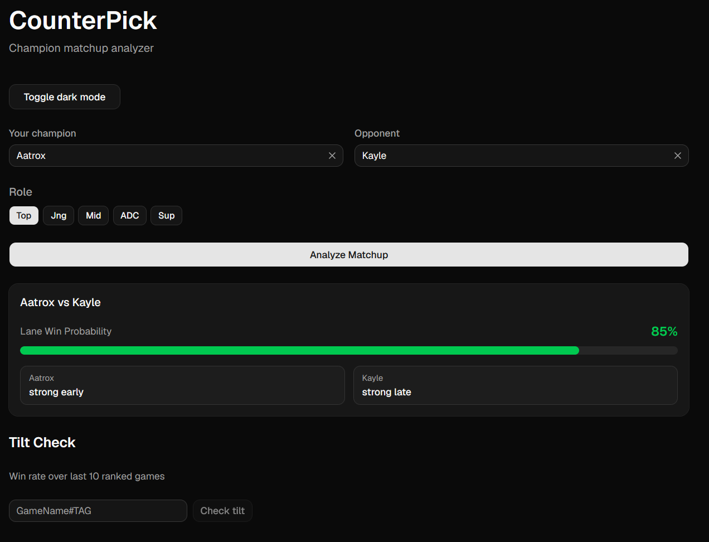
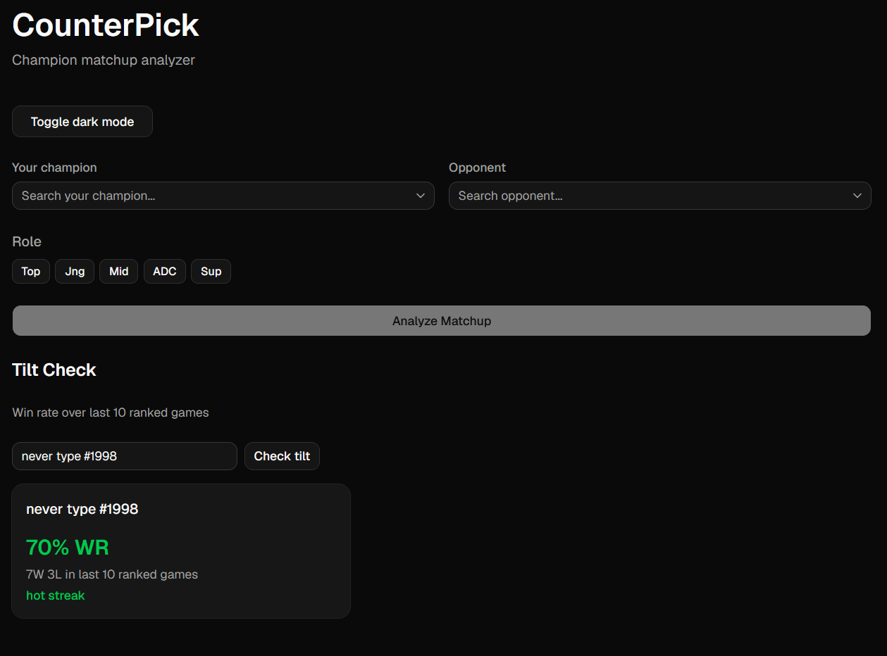
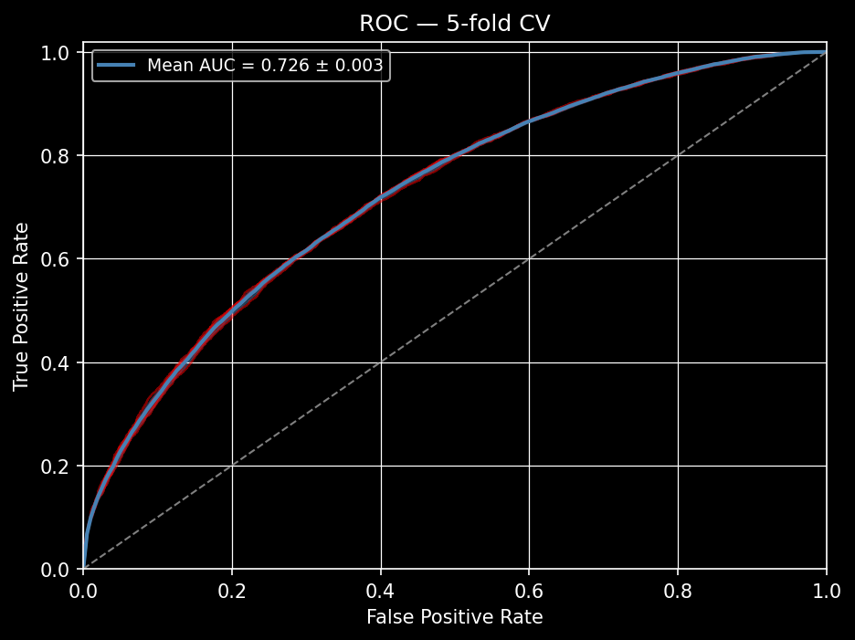
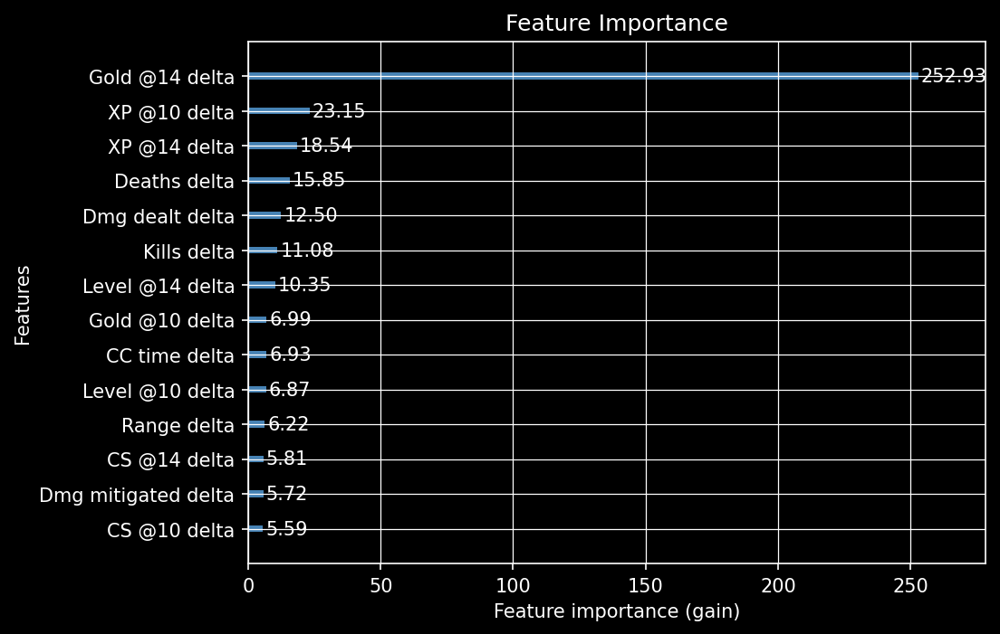
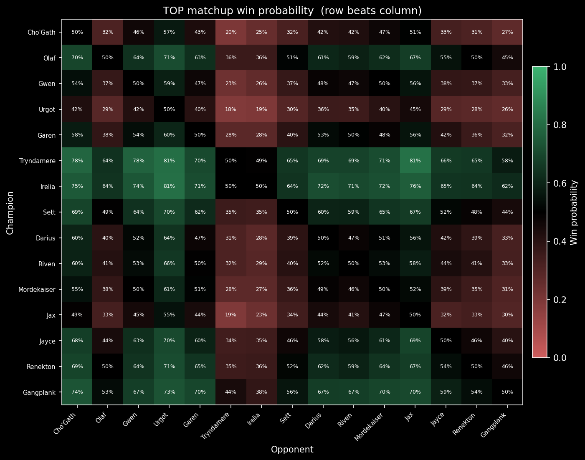

# CounterPick: LoL Lane Matchup Analyzer

A web app that tells you how your champion matchup plays out and when you are strongest, built for use during champ select. Made for a personal project.

---

## Setup

Clone the repo, then run the setup script specific for your device. It installs Python dependencies and frontend Node modules in one step.

**Windows:**
```bat
setup.bat
run_pipeline.bat
```

**Mac/Linux:**
```bash
chmod +x setup.sh && ./setup.sh
chmod +x run_pipeline.sh && ./run_pipeline.sh
```

To start the app after setup & running pipeline:
```bash
# Backend (from project root)
uvicorn src.api.main:app --reload

# Frontend (in a separate terminal)
cd frontend
npm run dev
```

* A prebuilt database (`test.db`) is included so you can run the pipeline & app immediately without a Riot API key. Pulling fresh data takes several hours and requires adding your own key as an env variable(see `pull_matches.py`)
* The tilt indicator makes live Riot API calls and does not depend on the pipeline or database. It requires an API key but you can test it immediately after setup without running the pipeline.

## Features

**Matchup Lookup**

Input your champion, your opponent's, and your role. Get back a predicted win rate, an early/mid/late power breakdown, and a summary of how the matchup plays out.




**Tilt Indicator**

Look up any summoner to see their win rate over their last 10 games. Quick way to gauge a teammate or opponent during champ select.



## Stack

- **Frontend:** React + TypeScript, Vite, Tailwind CSS, shadcn
- **Backend:** FastAPI
- **ML:** XGBoost
- **Data:** Riot Games API (match-v5)
- **Database:** SQLite

---

## How It Works

Pulls ranked match data from the Riot API across Gold, Platinum, Emerald, and Diamond. Processes raw in-game stats like gold, CC time, damage output, and game duration into per-champion behavioral profiles, then trains an XGBoost model to predict matchup win rates and power spikes by game phase. Rather than looking up specific champion pairings, the model learns each champion's properties independently, so uncommon matchups still get a reasonable prediction.

For a full breakdown of the technical decisions and architecture, see [DESIGN.md](docs/DESIGN.md).


## Model Performance

### ROC Curve



The curve plots true positive rate against false positive rate. A line that bends toward the top-left means the model catches wins correctly without many false calls. The diagonal in the middle is random guessing(50% of guessing right at random). AUC measures how far above the diagonal the curve sits: 0.5 is random, 1.0 is perfect.

The curve here sits well above the diagonal and hugs the top-left corner, meaning the model reliably separates wins from losses. The red standard deviation fill around the mean line stays narrow, as each of the 5 folds produced curves very close in value to the mean. This points to the fact that the model performs consistently regardless of which slice of data it was tested on.

---

### Feature Importance



The bars are ranked by how much each stat reduces prediction error. Longer bar means more impact on the model's decision.

Lane stats at 14 minutes take up most of the chart. Champions that build early leads in gold, XP, CS, and level tend to win their matchups, and the model has picked up on that clearly. Champion properties like CC time and range contribute but trail well behind the lane performance stats.

Gold @14 leads the chart by a wide margin. This is expected: gold at 14 minutes is itself a composite of everything that happened in lane, as CS, kills, assists, and tower plates all feed directly into it. The model is effectively learning that gold lead is the strongest summary of who is winning the lane.

---

### Champion Matchup Heatmap



Each cell is the predicted win rate for the row champion against the column champion. Green means the row champion is favoured, red means the column champion is favoured. The diagonal is always 50% since a champion cannot play against itself.

Clear patterns show up across the grid. Some champions have mostly green rows, meaning they beat most of the meta pool and are reliable blind picks. Others are mixed, meaning they rely on hitting specific good matchups rather than being generally strong.


---

## Disclaimer

This project uses the Riot Games API but is not endorsed or certified by Riot Games.
